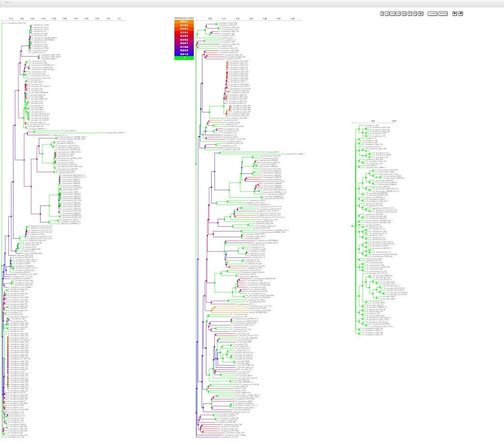
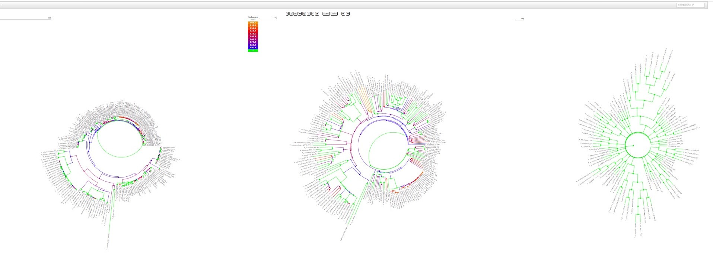

# 🌿 Phylogenetic Tree Comparison Tool

Most existing tools allow you to view **only one phylogenetic tree at a time**. This project solves that limitation by enabling you to load and compare **two trees side-by-side**, making it easier to visually spot differences and similarities between tree structures.

Our application supports both **linear** and **radial** views and provides interactive features to make comparison intuitive and fast.

---

## 🛠 Installation

Before you begin, ensure that **Node.js and npm** are installed on your system.

To install dependencies, run:

```bash
npm install
```

## Our Application looks the following when two trees are loaded

Linear view


Radial view


